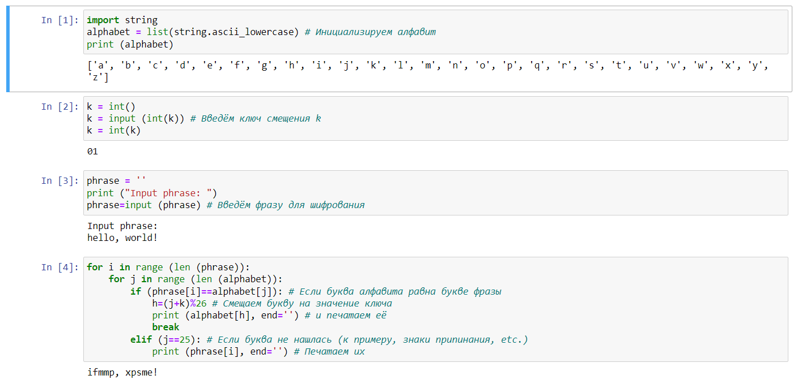
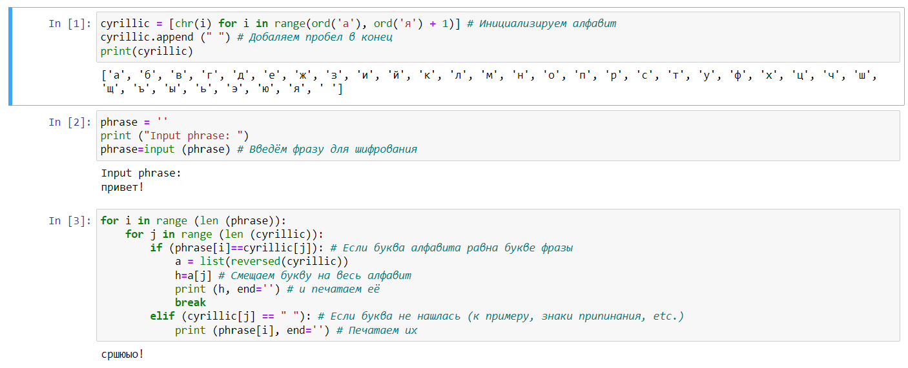

---
## Front matter
lang: ru-RU
title: Лабораторная работа №1. Шифры простой замены.
author: |
	Alexander S. Baklashov
institute: |
	RUDN University, Moscow, Russian Federation

date: 16 September, 2023

## Formatting
toc: false
slide_level: 2
theme: metropolis
header-includes: 
 - \metroset{progressbar=frametitle,sectionpage=progressbar,numbering=fraction}
 - '\makeatletter'
 - '\beamer@ignorenonframefalse'
 - '\makeatother'
aspectratio: 43
section-titles: true
---

# Цель работы

Рассмотреть шифры простой замены, а именно:

$-$ Шифр Цезаря

$-$ Шифр Атбаш

# Задачи

1. Реализовать шифр Цезаря с произвольным ключом $k$.
2. Реализовать шифр Атбаш.

## Задача

Реализовать шифр Цезаря с произвольным ключом $k$.

## Шифр Цезаря

{width=110%}

## Задача

Реализовать шифр Атбаш.

## Шифр Атбаш

{width=110% }

# Вывод

В ходе данной лабораторной работы я рассмотрел и реализовал такие шифры простой замены, как шифр Цезаря и шифр Атбаш.