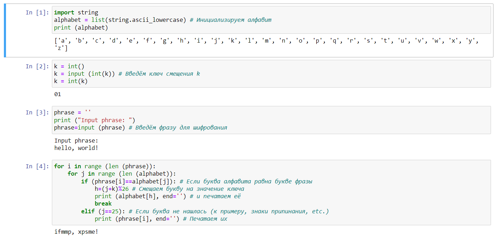
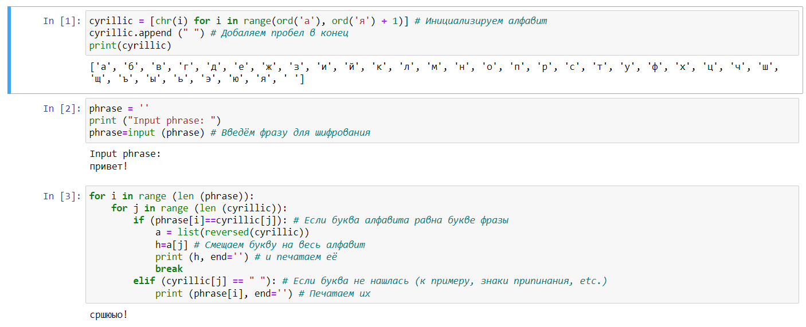

---
# Front matter
title: "Лабораторная работа №1. Шифры простой замены."
subtitle: "Предмет: Математические основы защиты информации и информационной безопасности"
author: "Александр Сергеевич Баклашов"

# Generic otions
lang: ru-RU
toc-title: "Содержание"

# Bibliography
bibliography: bib/cite.bib
csl: pandoc/csl/gost-r-7-0-5-2008-numeric.csl

# References settings
linkReferences: true
nameInLink: true

# Pdf output format
toc: true # Table of contents
toc_depth: 2
lof: true # List of figures
lot: false # List of tables
fontsize: 12pt
linestretch: 1.25
papersize: a4
documentclass: scrreprt
## I18n
polyglossia-lang:
  name: russian
  options:
	- spelling=modern
	- babelshorthands=true
polyglossia-otherlangs:
  name: english
### Fonts
mainfont: PT Serif
romanfont: PT Serif
sansfont: PT Sans
monofont: PT Mono
mainfontoptions: Ligatures=TeX
romanfontoptions: Ligatures=TeX
sansfontoptions: Ligatures=TeX,Scale=MatchLowercase
monofontoptions: Scale=MatchLowercase,Scale=0.9
## Biblatex
biblatex: true
biblio-style: "gost-numeric"
biblatexoptions:
  - parentracker=true
  - backend=biber
  - hyperref=auto
  - language=auto
  - autolang=other*
  - citestyle=gost-numeric
## Misc options
indent: true
header-includes:
  - \linepenalty=10 # the penalty added to the badness of each line within a paragraph (no associated penalty node) Increasing the value makes tex try to have fewer lines in the paragraph.
  - \interlinepenalty=0 # value of the penalty (node) added after each line of a paragraph.
  - \hyphenpenalty=50 # the penalty for line breaking at an automatically inserted hyphen
  - \exhyphenpenalty=50 # the penalty for line breaking at an explicit hyphen
  - \binoppenalty=700 # the penalty for breaking a line at a binary operator
  - \relpenalty=500 # the penalty for breaking a line at a relation
  - \clubpenalty=150 # extra penalty for breaking after first line of a paragraph
  - \widowpenalty=150 # extra penalty for breaking before last line of a paragraph
  - \displaywidowpenalty=50 # extra penalty for breaking before last line before a display math
  - \brokenpenalty=100 # extra penalty for page breaking after a hyphenated line
  - \predisplaypenalty=10000 # penalty for breaking before a display
  - \postdisplaypenalty=0 # penalty for breaking after a display
  - \floatingpenalty = 20000 # penalty for splitting an insertion (can only be split footnote in standard LaTeX)
  - \raggedbottom # or \flushbottom
  - \usepackage{float} # keep figures where there are in the text
  - \floatplacement{figure}{H} # keep figures where there are in the text
---

# Цель работы

Рассмотреть шифры простой замены, а именно:

$-$ Шифр Цезаря

$-$ Шифр Атбаш

# Задание

1. Реализовать шифр Цезаря с произвольным ключом $k$.
2. Реализовать шифр Атбаш.

# Теоретическое введение

Шифр Цезаря — это вид шифра подстановки, в котором каждый символ в открытом тексте заменяется символом, находящимся на некотором постоянном числе позиций левее или правее него в алфавите. Например, в шифре со сдвигом вправо на 3, А была бы заменена на Г, Б станет Д, и так далее.

Шифр назван в честь римского полководца Гая Юлия Цезаря, использовавшего его для секретной переписки со своими генералами.

Шифр Атбаш — это простой метод шифрования, при котором буквы сдвигаются на всю длину алфавита. 

# Выполнение лабораторной работы

## Шифр Цезаря

### Задача

Реализовать шифр Цезаря с произвольным ключом $k$.

#### Решение

Для начала, инициализируем алфавит (латинские буквы нижнего регистра), затем предложим ввести ключ смещения и фразу. После введения фразы, приступаем к реализации шифрования: проходимся по буквам фразы и алфавита. Если находится совпадение $-$ смещаем букву на количество букв алфавита, равное ключу шифрования, и печатаем результат.

Если совпадений нет (например, написаны знаки препинания), печатаем символы без изменений.(рис. [-@fig:001])

{ #fig:001 width=80% }

## Шифр Атбаш

### Задача

Реализовать шифр Атбаш

#### Решение

Для начала, инициализируем алфавит (кириллица нижнего регистра), также добавим пробел в конце алфавита. Затем предложим ввести фразу. После введения фразы, приступаем к реализации шифрования: проходимся по буквам фразы и алфавита. Если находится совпадение $-$ смещаем букву на весь алфавит, и печатаем результат.

Если совпадений нет (например, написаны знаки препинания), печатаем символы без изменений. (рис. [-@fig:002])

{ #fig:002 width=80% }

# Выводы

В ходе данной лабораторной работы я рассмотрел и реализовал такие шифры простой замены, как шифр Цезаря и шифр Атбаш.

# Библиография

1. Python documentation. [Электронный ресурс]. М. URL: [Python documentation](https://docs.python.org/3/index.html) (Дата обращения: 16.09.2023).

2. Лабораторная работа №1. Задача о погоне. - 4 с. [Электронный ресурс]. М. URL: [Лабораторная работа №1. Шифры простой замены.](https://esystem.rudn.ru/pluginfile.php/2089782/mod_folder/content/0/lab01.pdf) (Дата обращения: 16.09.2023).