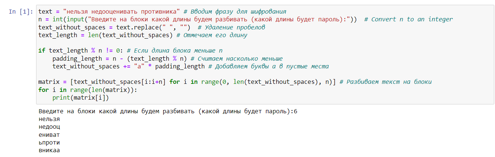

---
## Front matter
lang: ru-RU
title: Лабораторная работа №2. Шифры перестановки.
author: |
	Alexander S. Baklashov
institute: |
	RUDN University, Moscow, Russian Federation

date: 28 September, 2023

## Formatting
toc: false
slide_level: 2
theme: metropolis
header-includes: 
 - \metroset{progressbar=frametitle,sectionpage=progressbar,numbering=fraction}
 - '\makeatletter'
 - '\beamer@ignorenonframefalse'
 - '\makeatother'
aspectratio: 43
section-titles: true
---

# Цель работы

Рассмотреть шифры перестановки, а именно:

$-$ Маршрутное шифрование

$-$ Шифрование с помощью решеток

$-$ Таблица Виженера

# Задачи

1. Реализовать маршрутное шифрование.
2. Реализовать шифрование с помощью решеток.
3. Реализовать шифрование с помощью таблицы Виженера.

## Задача

Реализовать маршрутное шифрование.

## Маршрутное шифрование

Запросим длину блоков и разобьем текст на них 

{ #fig:001 width=80% }

## Маршрутное шифрование

Запросим пароль и построим столбцы в соотв. с алф. порядком букв в пароле 

{ #fig:002 width=80% }

## Маршрутное шифрование

Выведем результат

{ #fig:003 width=80% }

## Задача

Реализовать шифрование с помощью решеток.

## Шифрование с помощью решеток

Заполним исх. матрицу и выявим ячейки, числа в которых будем вырезать 

{ #fig:004 width=80% }

## Шифрование с помощью решеток

Зададим шифротекст и ключ и выведем результат, поворачивая матрицу против часовой стрелки и вставляя соотв. буквы

{ #fig:005 width=80% }

## Шифрование с помощью таблицы Виженера

Создадим функцию для шифрования

{ #fig:006 width=80% }

## Шифрование с помощью таблицы Виженера

Создадим функцию для дешифрования

{ #fig:007 width=80% }

## Шифрование с помощью таблицы Виженера

Зададим шифротекст и ключ и выведем результат

{ #fig:008 width=80% }

# Вывод

В ходе данной лабораторной работы я рассмотрел и реализовал такие шифры перестановки, как маршрутное шифрование, шифрование с помощью решеток и таблица Виженера.