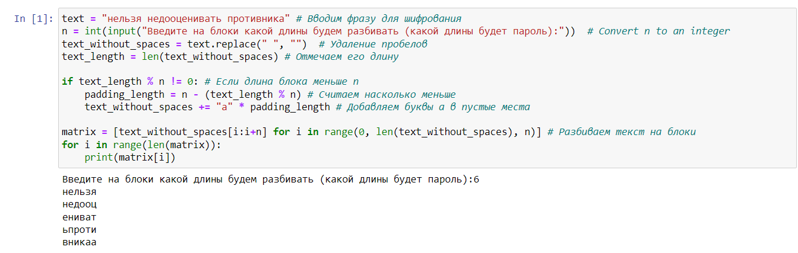
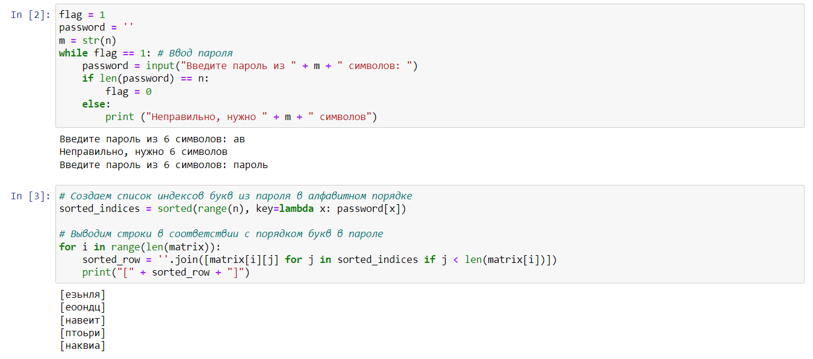
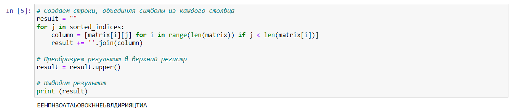
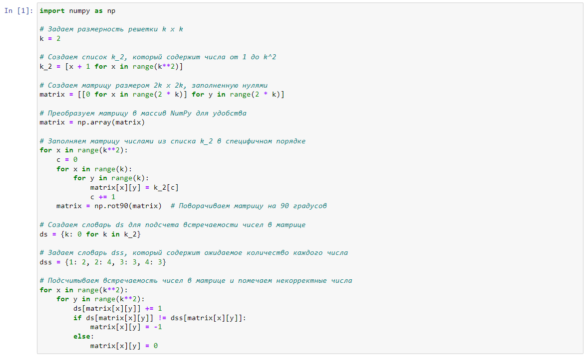
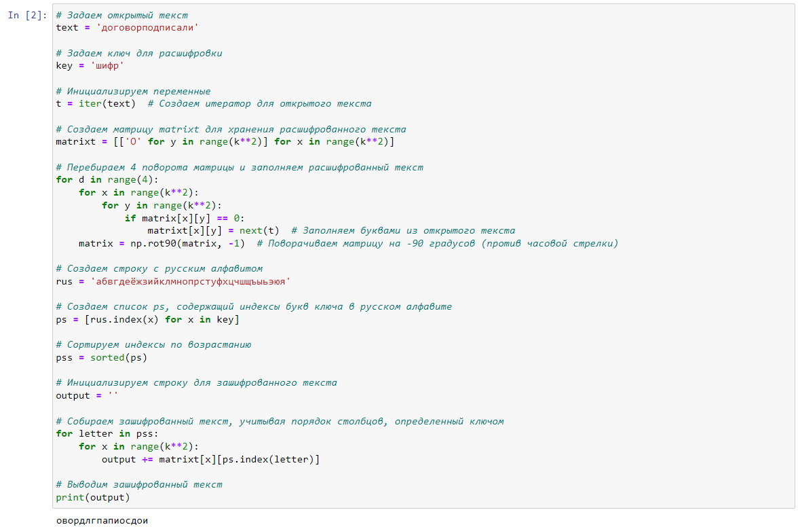
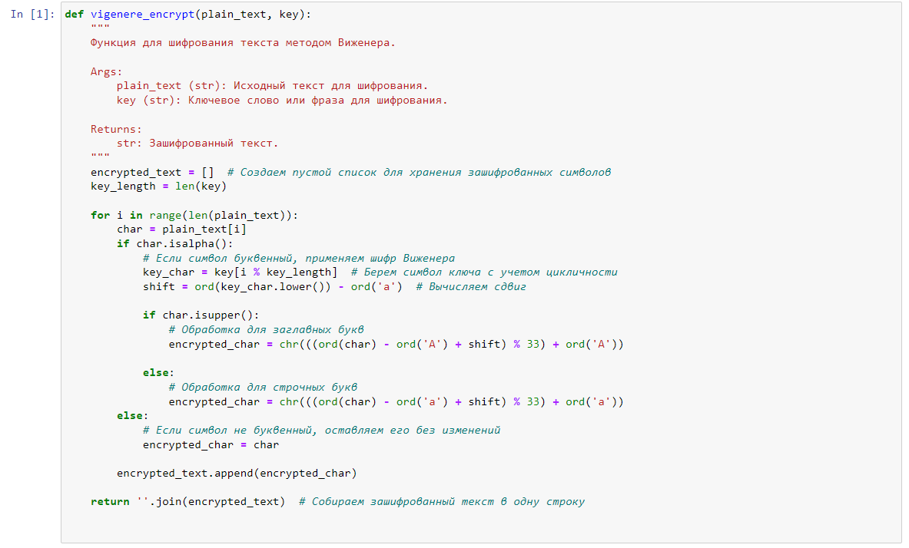
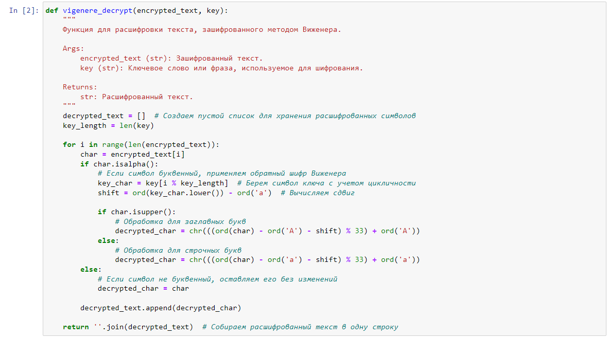
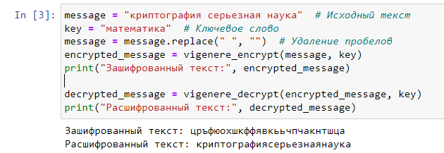

---
# Front matter
title: "Лабораторная работа №2. Шифры перестановки."
subtitle: "Предмет: Математические основы защиты информации и информационной безопасности"
author: "Александр Сергеевич Баклашов"

# Generic otions
lang: ru-RU
toc-title: "Содержание"

# Bibliography
bibliography: bib/cite.bib
csl: pandoc/csl/gost-r-7-0-5-2008-numeric.csl

# References settings
linkReferences: true
nameInLink: true

# Pdf output format
toc: true # Table of contents
toc_depth: 2
lof: true # List of figures
lot: false # List of tables
fontsize: 12pt
linestretch: 1.25
papersize: a4
documentclass: scrreprt
## I18n
polyglossia-lang:
  name: russian
  options:
	- spelling=modern
	- babelshorthands=true
polyglossia-otherlangs:
  name: english
### Fonts
mainfont: PT Serif
romanfont: PT Serif
sansfont: PT Sans
monofont: PT Mono
mainfontoptions: Ligatures=TeX
romanfontoptions: Ligatures=TeX
sansfontoptions: Ligatures=TeX,Scale=MatchLowercase
monofontoptions: Scale=MatchLowercase,Scale=0.9
## Biblatex
biblatex: true
biblio-style: "gost-numeric"
biblatexoptions:
  - parentracker=true
  - backend=biber
  - hyperref=auto
  - language=auto
  - autolang=other*
  - citestyle=gost-numeric
## Misc options
indent: true
header-includes:
  - \linepenalty=10 # the penalty added to the badness of each line within a paragraph (no associated penalty node) Increasing the value makes tex try to have fewer lines in the paragraph.
  - \interlinepenalty=0 # value of the penalty (node) added after each line of a paragraph.
  - \hyphenpenalty=50 # the penalty for line breaking at an automatically inserted hyphen
  - \exhyphenpenalty=50 # the penalty for line breaking at an explicit hyphen
  - \binoppenalty=700 # the penalty for breaking a line at a binary operator
  - \relpenalty=500 # the penalty for breaking a line at a relation
  - \clubpenalty=150 # extra penalty for breaking after first line of a paragraph
  - \widowpenalty=150 # extra penalty for breaking before last line of a paragraph
  - \displaywidowpenalty=50 # extra penalty for breaking before last line before a display math
  - \brokenpenalty=100 # extra penalty for page breaking after a hyphenated line
  - \predisplaypenalty=10000 # penalty for breaking before a display
  - \postdisplaypenalty=0 # penalty for breaking after a display
  - \floatingpenalty = 20000 # penalty for splitting an insertion (can only be split footnote in standard LaTeX)
  - \raggedbottom # or \flushbottom
  - \usepackage{float} # keep figures where there are in the text
  - \floatplacement{figure}{H} # keep figures where there are in the text
---

# Цель работы

Рассмотреть шифры перестановки, а именно:

$-$ Маршрутное шифрование

$-$ Шифрование с помощью решеток

$-$ Таблица Виженера

# Задание

1. Реализовать маршрутное шифрование.
2. Реализовать шифрование с помощью решеток.
3. Реализовать шифрование с помощью таблицы Виженера.

# Теоретическое введение

## Маршрутное шифрование

Этот способ шифрования изобрел выдающийся французский математик и криптограф Франсуа Виет (1540-1603).

Пусть m и n – некоторые натуральные (т.е. целые положительные) числа, каждое больше 1. Открытый текст последовательно разбивается на части (блоки) с длиной, равной произведению mn (если в последнем блоке не хватает букв, можно дописать до нужной длины произвольный их набор). Блок вписывается построчно в таблицу размерности m×n (т.е. m строк и n столбцов). Криптограмма получается выписыванием букв из таблицы в соответствии с некоторым маршрутом. Этот маршрут вместе с числами m и n составляет ключ шифра.

## Шифрование с помощью решеток

Шифрование с использованием решеток (или квадратных сеток) - это метод шифрования, который предлагает различные способы организации текста внутри квадратной сетки и затем извлечения информации из этой сетки с помощью ключа или другой инструкции. Этот метод шифрования обеспечивает некоторую степень защиты данных, особенно когда криптографический ключ сложно угадать или определить без знания специфических правил.

## Шифрование с помощью таблицы Виженера

Шифр Виженера (фр. Chiffre de Vigenère) — метод полиалфавитного шифрования буквенного текста с использованием ключевого слова.

Этот метод является простой формой многоалфавитной замены. Шифр Виженера изобретался многократно. Впервые этот метод описал Джовани Баттиста Белласо (итал. Giovan Battista Bellaso) в книге La cifra del. Sig. Giovan Battista Bellasо в 1553 году, однако в XIX веке получил имя Блеза Виженера, французского дипломата. Метод прост для понимания и реализации, но является недоступным для простых методов криптоанализа.

Хотя шифр легко понять и реализовать, на протяжении трех столетий он противостоял всем попыткам его сломать; чем и заработал имя le chiffre indéchiffrable (фр. неразгаданный шифр). Многие люди пытались реализовать схемы шифрования, которые по сути являлись шифрами Виженера.

# Выполнение лабораторной работы

## Маршрутное шифрование

### Задача

Реализовать маршрутное шифрование.

#### Решение

Запросим длину блоков и разобьем текст на них (рис. [-@fig:001])

{ #fig:001 width=80% }

Запросим пароль и построим столбцы в соотв. с алф. порядком букв в пароле (рис. [-@fig:002])

{ #fig:002 width=80% }

Выведем результат (рис. [-@fig:003])

{ #fig:003 width=80% }

## Шифрование с помощью решеток

### Задача

Реализовать шифрование с помощью решеток.

#### Решение

Заполним исх. матрицу и выявим ячейки, числа в которых будем вырезать (рис. [-@fig:004])

{ #fig:004 width=80% }

Зададим шифротекст и ключ и выведем результат, поворачивая матрицу против часовой стрелки и вставляя соотв. буквы (рис. [-@fig:005])

{ #fig:005 width=80% }

## Шифрование с помощью таблицы Виженера

### Задача

Реализовать шифрование с помощью таблицы Виженера.

#### Решение

Создадим функцию для шифрования (рис. [-@fig:006])

{ #fig:006 width=80% }

Создадим функцию для дешифрования (рис. [-@fig:007])

{ #fig:007 width=80% }

Зададим шифротекст и ключ и выведем результат (рис. [-@fig:008])

{ #fig:008 width=80% }

# Выводы

В ходе данной лабораторной работы я рассмотрел и реализовал такие шифры перестановки, как маршрутное шифрование, шифрование с помощью решеток и таблица Виженера.

# Библиография

1. Python documentation. [Электронный ресурс]. М. URL: [Python documentation](https://docs.python.org/3/index.html) (Дата обращения: 28.09.2023).

2. Лабораторная работа №1. Задача о погоне. - 4 с. [Электронный ресурс]. М. URL: [Лабораторная работа №2. Шифры перестановки.](https://esystem.rudn.ru/pluginfile.php/2089789/mod_folder/content/0/lab02.pdf) (Дата обращения: 28.09.2023).