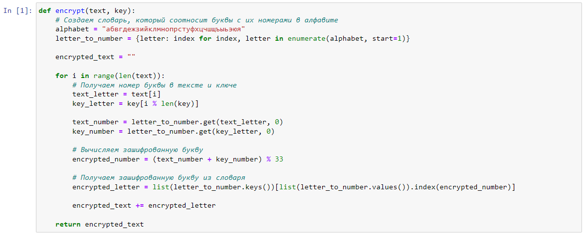
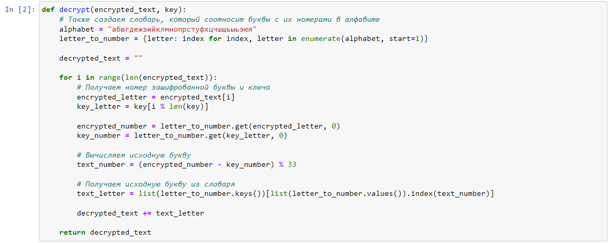
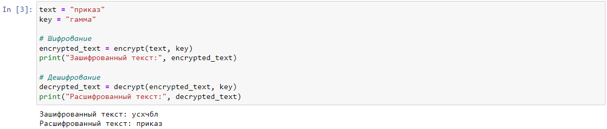

---
## Front matter
lang: ru-RU
title: Лабораторная работа №3. Шифрование гаммированием.
author: |
	Alexander S. Baklashov
institute: |
	RUDN University, Moscow, Russian Federation

date: 07 October, 2023

## Formatting
toc: false
slide_level: 2
theme: metropolis
header-includes: 
 - \metroset{progressbar=frametitle,sectionpage=progressbar,numbering=fraction}
 - '\makeatletter'
 - '\beamer@ignorenonframefalse'
 - '\makeatother'
aspectratio: 43
section-titles: true
---

# Цель работы

Рассмотреть и реализовать алгоритм шифрования гаммированием конечной гаммой.

# Задачи

Реализовать шифрование гаммированием конечной гаммой.

## Шифрование гаммированием конечной гаммой. Функция для шифрования текста.

Напишем функцию для шифрования текста

{ #fig:001 width=100% }

## Шифрование гаммированием конечной гаммой. Функция для дешифрования текста.

Напишем функцию для дешифрования текста 

{ #fig:002 width=100% }

## Шифрование гаммированием конечной гаммой. Реализация.

Напишем реализацию шифрования гаммированием конечной гаммой с помощью функций

{ #fig:003 width=100% }

# Вывод

В ходе данной лабораторной работы я рассмотрел и реализовал алгоритм шифрования гаммированием конечной гаммой.