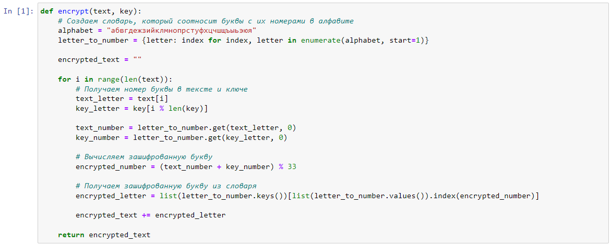
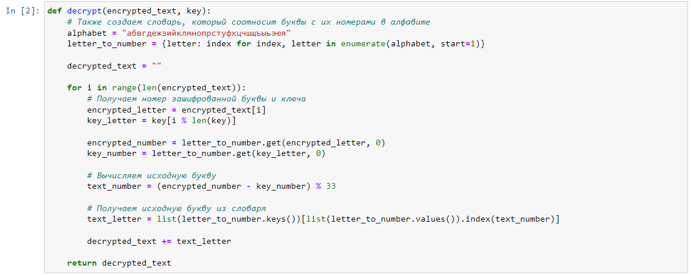
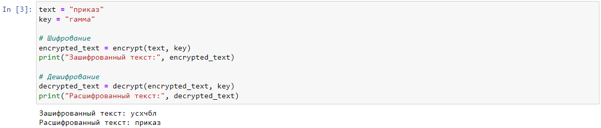

---
# Front matter
title: "Лабораторная работа №3. Шифрование гаммированием."
subtitle: "Предмет: Математические основы защиты информации и информационной безопасности"
author: "Александр Сергеевич Баклашов"

# Generic otions
lang: ru-RU
toc-title: "Содержание"

# Bibliography
bibliography: bib/cite.bib
csl: pandoc/csl/gost-r-7-0-5-2008-numeric.csl

# References settings
linkReferences: true
nameInLink: true

# Pdf output format
toc: true # Table of contents
toc_depth: 2
lof: true # List of figures
lot: false # List of tables
fontsize: 12pt
linestretch: 1.25
papersize: a4
documentclass: scrreprt
## I18n
polyglossia-lang:
  name: russian
  options:
	- spelling=modern
	- babelshorthands=true
polyglossia-otherlangs:
  name: english
### Fonts
mainfont: PT Serif
romanfont: PT Serif
sansfont: PT Sans
monofont: PT Mono
mainfontoptions: Ligatures=TeX
romanfontoptions: Ligatures=TeX
sansfontoptions: Ligatures=TeX,Scale=MatchLowercase
monofontoptions: Scale=MatchLowercase,Scale=0.9
## Biblatex
biblatex: true
biblio-style: "gost-numeric"
biblatexoptions:
  - parentracker=true
  - backend=biber
  - hyperref=auto
  - language=auto
  - autolang=other*
  - citestyle=gost-numeric
## Misc options
indent: true
header-includes:
  - \linepenalty=10 # the penalty added to the badness of each line within a paragraph (no associated penalty node) Increasing the value makes tex try to have fewer lines in the paragraph.
  - \interlinepenalty=0 # value of the penalty (node) added after each line of a paragraph.
  - \hyphenpenalty=50 # the penalty for line breaking at an automatically inserted hyphen
  - \exhyphenpenalty=50 # the penalty for line breaking at an explicit hyphen
  - \binoppenalty=700 # the penalty for breaking a line at a binary operator
  - \relpenalty=500 # the penalty for breaking a line at a relation
  - \clubpenalty=150 # extra penalty for breaking after first line of a paragraph
  - \widowpenalty=150 # extra penalty for breaking before last line of a paragraph
  - \displaywidowpenalty=50 # extra penalty for breaking before last line before a display math
  - \brokenpenalty=100 # extra penalty for page breaking after a hyphenated line
  - \predisplaypenalty=10000 # penalty for breaking before a display
  - \postdisplaypenalty=0 # penalty for breaking after a display
  - \floatingpenalty = 20000 # penalty for splitting an insertion (can only be split footnote in standard LaTeX)
  - \raggedbottom # or \flushbottom
  - \usepackage{float} # keep figures where there are in the text
  - \floatplacement{figure}{H} # keep figures where there are in the text
---

# Цель работы

Рассмотреть и реализовать алгоритм шифрования гаммированием конечной гаммой.

# Задание

Реализовать шифрование гаммированием конечной гаммой.

# Теоретическое введение

## Шифрование гаммированием конечной гаммой

Гаммирование конечной гаммой $-$ это один из методов симметричного шифрования, который использует последовательность случайных символов (гамму), имеющую конечную длину, для шифрования и расшифрования сообщения. В данном методе каждый символ исходного текста комбинируется с соответствующим символом из гаммы с использованием операции побитового XOR (исключающее ИЛИ). Центральной идеей является то, что использование гаммы делает шифрованный текст статистически случайным и с трудом поддается анализу.

Теоретическое введение в гаммирование конечной гаммой включает следующие ключевые понятия и аспекты:

Симметричное шифрование: Гаммирование конечной гаммой относится к симметричным методам шифрования, где один и тот же ключ (гамма) используется как для шифрования, так и для расшифрования сообщения. Это отличается от асимметричных методов, где используются разные ключи для шифрования и расшифрования.

Последовательность гаммы: Гамма представляет собой последовательность символов (обычно битов или байтов), имеющую конечную длину. Для успешного шифрования и расшифрования длина гаммы должна быть такой же, как длина исходного текста.

Операция XOR: Для каждого символа исходного текста и символа гаммы выполняется операция XOR. Это операция, которая возвращает 1 (или true), если биты операндов разные, и 0 (или false), если биты одинаковые.

Ключевое пространство: Ключевое пространство метода гаммирования конечной гаммой зависит от длины гаммы. Чем больше длина гаммы, тем больше возможных ключей и, следовательно, тем выше стойкость шифрования.

Стойкость к криптоанализу: Стойкость шифра гаммирования конечной гаммой зависит от случайности и длины гаммы. Чем более случайной и длинной является гамма, тем сложнее проводить атаки на шифр, такие как атаки методом частотного анализа.

Гаммирование конечной гаммой остается одним из важных методов симметричного шифрования, и его применение может быть найдено в различных областях, включая информационную безопасность, сетевые коммуникации, телекоммуникации и другие сферы, где требуется конфиденциальность и защита данных от несанкционированного доступа.

# Выполнение лабораторной работы

## Шифрование гаммированием конечной гаммой

### Задача

Реализовать шифрование гаммированием конечной гаммой

#### Решение

Напишем функцию для шифрования текста (рис. [-@fig:001])

{ #fig:001 width=80% }

Напишем функцию для дешифрования текста (рис. [-@fig:002])

{ #fig:002 width=80% }

Напишем реализацию шифрования гаммированием конечной гаммой с помощью функций (рис. [-@fig:003])

{ #fig:003 width=80% }

# Выводы

В ходе данной лабораторной работы я рассмотрел и реализовал алгоритм шифрования гаммированием конечной гаммой.

# Библиография

1. Python documentation. [Электронный ресурс]. М. URL: [Python documentation](https://docs.python.org/3/index.html) (Дата обращения: 28.09.2023).

2. Лабораторная работа №3. Шифрование гаммированием. - 3 с. [Электронный ресурс]. М. URL: [Лабораторная работа №3. Шифрование гаммированием.](https://esystem.rudn.ru/pluginfile.php/2089797/mod_folder/content/0/lab03.pdf) (Дата обращения: 07.10.2023).