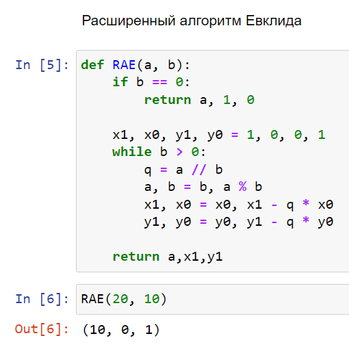

---
## Front matter
lang: ru-RU
title: Лабораторная работа №4. Вычисление НОД.
author: |
	Alexander S. Baklashov
institute: |
	RUDN University, Moscow, Russian Federation

date: 19 October, 2023

## Formatting
toc: false
slide_level: 2
theme: metropolis
header-includes: 
 - \metroset{progressbar=frametitle,sectionpage=progressbar,numbering=fraction}
 - '\makeatletter'
 - '\beamer@ignorenonframefalse'
 - '\makeatother'
aspectratio: 43
section-titles: true
---

# Цель работы

Рассмотреть и реализовать алгоритмы нахождения НОД.

# Задачи

Реализовать следующие алгоритмы:

- Алгоритм Евклида;

- Бинарный алгоритм Евклида;

- Расширенный алгоритм Евклида;

- Расширенный бинарный алгоритм Евклида.

## Алгоритм Евклида

Реализуем алгоритм Евклида

{ #fig:001 width=40% }

## Бинарный алгоритм Евклида

Реализуем бинарный алгоритм Евклида

{ #fig:002 width=70% }

## Расширенный алгоритм Евклида

Реализуем расширенный алгоритм Евклида (рис. [-@fig:003])

{ #fig:003 width=40% }

## Расширенный бинарный алгоритм Евклида

Реализуем расширенный бинарный алгоритм Евклида

{ #fig:004 width=30% }

# Вывод

В ходе данной лабораторной работы я рассмотрел и реализовал следующие алгоритмы:

- Алгоритм Евклида;

- Бинарный алгоритм Евклида;

- Расширенный алгоритм Евклида;

- Расширенный бинарный алгоритм Евклида.