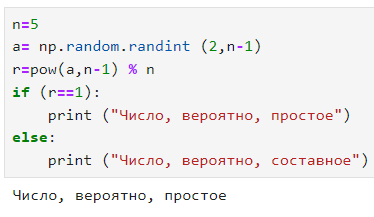
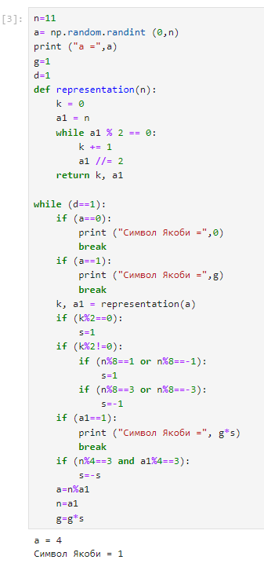
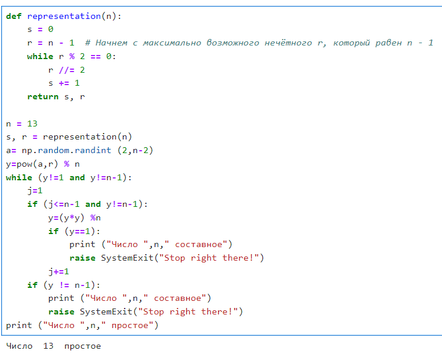

---
## Front matter
lang: ru-RU
title: Лабораторная работа №5. Вероятностные алгоритмы проверки чисел на простоту.
author: |
	Alexander S. Baklashov
institute: |
	RUDN University, Moscow, Russian Federation

date: 10 Novvember, 2023

## Formatting
toc: false
slide_level: 2
theme: metropolis
header-includes: 
 - \metroset{progressbar=frametitle,sectionpage=progressbar,numbering=fraction}
 - '\makeatletter'
 - '\beamer@ignorenonframefalse'
 - '\makeatother'
aspectratio: 43
section-titles: true
---

# Цель работы

Рассмотреть и реализовать алгоритмы проверки чисел на простоту.

# Задачи

Реализовать следующие алгоритмы:

- Тест Ферма;

- Нахождение символа Якоби;

- Тест Соловэя-Штрассена;

- Тест Миллера-Рабина.

## Тест Ферма

Реализуем тест Ферма

{ #fig:001 width=40% }

## Нахождение символа Якоби

Найдём символ Якоби

{ #fig:002 width=30% }

## Тест Соловэя-Штрассена

Реализуем тест Соловэя-Штрассена 

{ #fig:003 width=40% }

## Тест Миллера-Рабина

Реализуем тест Миллера-Рабина

{ #fig:004 width=60% }

# Вывод

В ходе данной лабораторной работы я рассмотрел и реализовал следующие алгоритмы:

- Тест Ферма;

- Нахождение символа Якоби;

- Тест Соловэя-Штрассена;

- Тест Миллера-Рабина.