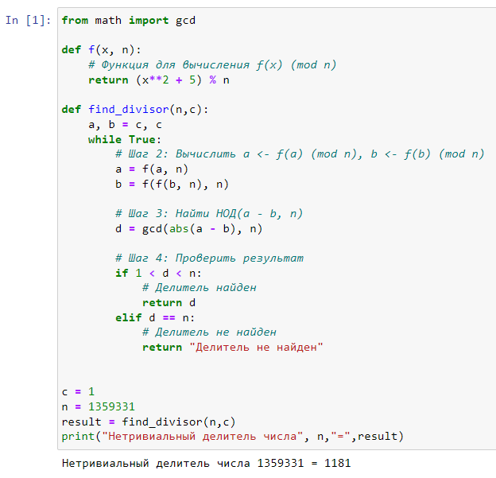
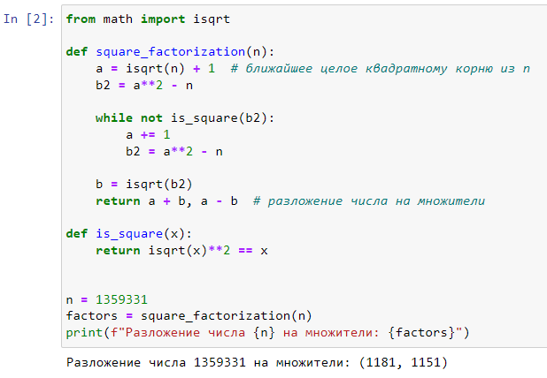

---
# Front matter
title: "Лабораторная работа №6. Разложение чисел на множители."
subtitle: "Предмет: Математические основы защиты информации и информационной безопасности"
author: "Александр Сергеевич Баклашов"

# Generic otions
lang: ru-RU
toc-title: "Содержание"

# Bibliography
bibliography: bib/cite.bib
csl: pandoc/csl/gost-r-7-0-5-2008-numeric.csl

# References settings
linkReferences: true
nameInLink: true

# Pdf output format
toc: true # Table of contents
toc_depth: 2
lof: true # List of figures
lot: false # List of tables
fontsize: 12pt
linestretch: 1.25
papersize: a4
documentclass: scrreprt
## I18n
polyglossia-lang:
  name: russian
  options:
	- spelling=modern
	- babelshorthands=true
polyglossia-otherlangs:
  name: english
### Fonts
mainfont: PT Serif
romanfont: PT Serif
sansfont: PT Sans
monofont: PT Mono
mainfontoptions: Ligatures=TeX
romanfontoptions: Ligatures=TeX
sansfontoptions: Ligatures=TeX,Scale=MatchLowercase
monofontoptions: Scale=MatchLowercase,Scale=0.9
## Biblatex
biblatex: true
biblio-style: "gost-numeric"
biblatexoptions:
  - parentracker=true
  - backend=biber
  - hyperref=auto
  - language=auto
  - autolang=other*
  - citestyle=gost-numeric
## Misc options
indent: true
header-includes:
  - \linepenalty=10 # the penalty added to the badness of each line within a paragraph (no associated penalty node) Increasing the value makes tex try to have fewer lines in the paragraph.
  - \interlinepenalty=0 # value of the penalty (node) added after each line of a paragraph.
  - \hyphenpenalty=50 # the penalty for line breaking at an automatically inserted hyphen
  - \exhyphenpenalty=50 # the penalty for line breaking at an explicit hyphen
  - \binoppenalty=700 # the penalty for breaking a line at a binary operator
  - \relpenalty=500 # the penalty for breaking a line at a relation
  - \clubpenalty=150 # extra penalty for breaking after first line of a paragraph
  - \widowpenalty=150 # extra penalty for breaking before last line of a paragraph
  - \displaywidowpenalty=50 # extra penalty for breaking before last line before a display math
  - \brokenpenalty=100 # extra penalty for page breaking after a hyphenated line
  - \predisplaypenalty=10000 # penalty for breaking before a display
  - \postdisplaypenalty=0 # penalty for breaking after a display
  - \floatingpenalty = 20000 # penalty for splitting an insertion (can only be split footnote in standard LaTeX)
  - \raggedbottom # or \flushbottom
  - \usepackage{float} # keep figures where there are in the text
  - \floatplacement{figure}{H} # keep figures where there are in the text
---

# Цель работы

Рассмотреть и реализовать алгоритм, реализующий p-метод Полларда и реализовать метод квадратов.

# Задание

Реализовать следующие алгоритмы:

- p-метод Полларда;

- Метод квадратов.

# Теоретическое введение

**p-Метод Полларда:**

p-Метод Полларда — это один из методов факторизации составных чисел, который был разработан Джоном Поллардом. Метод основан на свойствах мультипликативной группы вычетов по модулю простого числа p.

Метод Полларда работает основываясь на том, что при достаточном количестве итераций два значения в последовательности $x_i$ будут находиться в одном цикле и могут быть использованы для вычисления делителя.

Применение параметра $c$ в функции $f(x)$ позволяет разнообразить последовательность значений $f(x)$ и улучшить эффективность метода в некоторых случаях.

Метод Полларда является одним из алгоритмов факторизации, используемых для разложения больших составных чисел на их простые множители.

**Метод квадратов:**

Метод квадратов (Quadratic Sieve) — это алгоритм факторизации целых чисел, разработанный Карлом Померанцем и Джоном Поллелем. Этот метод основан на поиске целых чисел, которые представляют собой разность двух квадратов. Метод квадратов является одним из эффективных методов для факторизации больших составных чисел и часто применяется в криптографии. Вместе с методом факторизации ро (алгоритмом Полларда), он используется для атаки на криптографические системы, основанные на сложности факторизации больших чисел.

# Выполнение лабораторной работы

## p-Метод Полларда

### Задача

Реализовать p-Метод Полларда

#### Решение

Реализуем p-Метод Полларда  (рис. [-@fig:001])

{ #fig:001 width=80% }

## Метод квадратов

### Задача

Реализовать метод квадратов

#### Решение

Реализуем метод квадратов (рис. [-@fig:002])

{ #fig:002 width=80% }

# Выводы

В ходе данной лабораторной работы я рассмотрел и реализовал следующие алгоритмы:

- p-метод Полларда;

- Метод квадратов.

# Библиография

1. Python documentation. [Электронный ресурс]. М. URL: [Python documentation](https://docs.python.org/3/index.html) (Дата обращения: 28.09.2023).

2. Лабораторная работа №6. Разложение чисел на множители. - 3 с. [Электронный ресурс]. М. URL: [Лабораторная работа №6. Разложение чисел на множители.](https://esystem.rudn.ru/pluginfile.php/2089818/mod_folder/content/0/lab06.pdf) (Дата обращения: 22.11.2023).