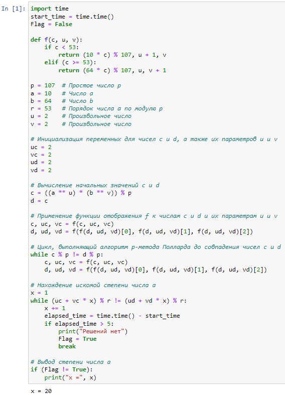

---
## Front matter
lang: ru-RU
title: Лабораторная работа №7. Дискретное логарифмирование в конечном поле.
author: |
	Alexander S. Baklashov
institute: |
	RUDN University, Moscow, Russian Federation

date: 30 November, 2023

## Formatting
toc: false
slide_level: 2
theme: metropolis
header-includes: 
 - \metroset{progressbar=frametitle,sectionpage=progressbar,numbering=fraction}
 - '\makeatletter'
 - '\beamer@ignorenonframefalse'
 - '\makeatother'
aspectratio: 43
section-titles: true
---

# Цель работы

Рассмотреть и реализовать алгоритм, реализующий $\rho$-метод Полларда для задач дискретного логарифмирования.

## $\rho$-Метод Полларда

Реализуем $\rho$-Метод Полларда

{ #fig:001 width=45% }

# Вывод

В ходе данной лабораторной работы я рассмотрел и реализовал алгоритм, реализующий $\rho$-метод Полларда для задач дискретного логарифмирования.