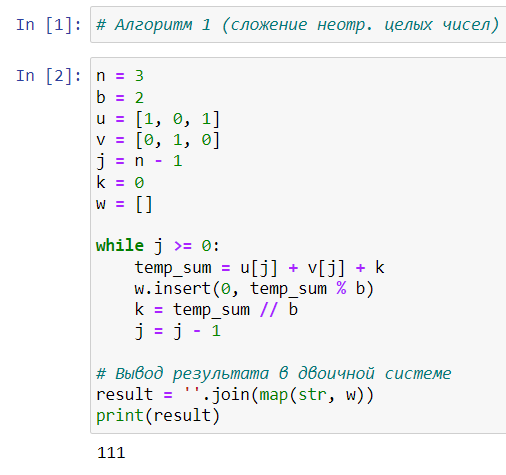
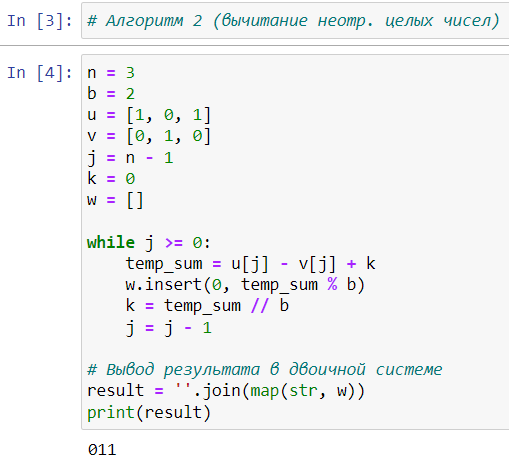
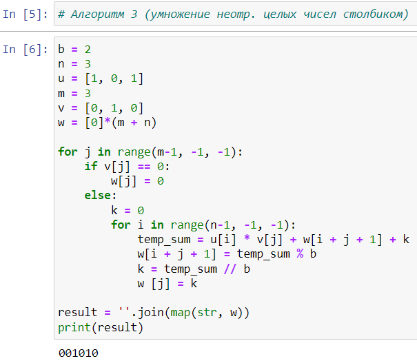
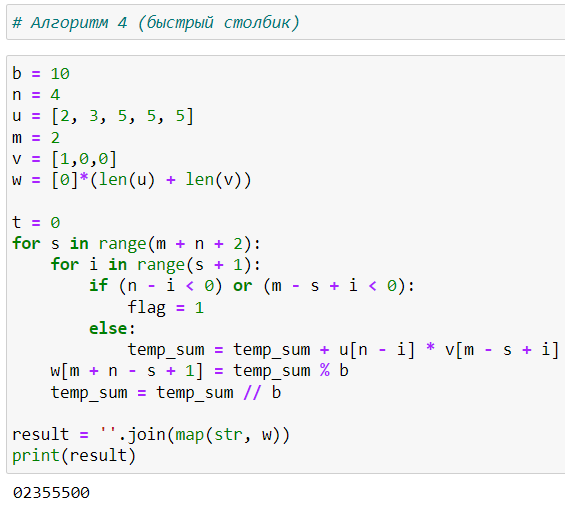
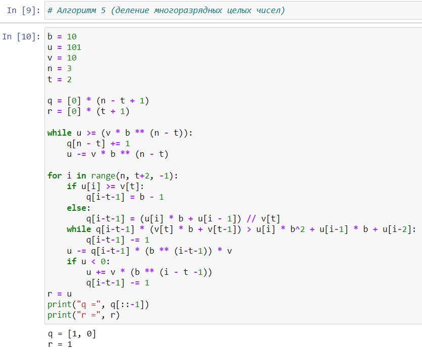

---
## Front matter
lang: ru-RU
title: Лабораторная работа №8. Целочисленная арифметика многократной точности.
author: |
	Alexander S. Baklashov
institute: |
	RUDN University, Moscow, Russian Federation

date: 20 December, 2023

## Formatting
toc: false
slide_level: 2
theme: metropolis
header-includes: 
 - \metroset{progressbar=frametitle,sectionpage=progressbar,numbering=fraction}
 - '\makeatletter'
 - '\beamer@ignorenonframefalse'
 - '\makeatother'
aspectratio: 43
section-titles: true
---

# Цель работы

Рассмотреть и реализовать алгоритмы для выполнения арифметических операций с большими целыми числами.

## Алгоритм 1 (сложение неотр. целых чисел)

Реализуем алгоритм для сложения неотрицательных целых чисел 

{ #fig:001 width=60% }

## Алгоритм 2 (вычитание неотр. целых чисел)

Реализуем алгоритм для вычитания неотрицательных целых чисел

{ #fig:002 width=60% }

## Алгоритм 3 (умножение неотр. целых чисел столбиком)

Реализуем алгоритм для умножения целых чисел столбиком

{ #fig:003 width=60% }

## Алгоритм 4 (быстрый столбик)

Реализуем алгоритм для умножения целых чисел быстрым столбиком 

{ #fig:004 width=60% }

## Алгоритм 5 (деление многоразрядных целых чисел)

Реализуем алгоритм для деления многоразрядных целых чисел 

{ #fig:005 width=70% }

# Вывод

В ходе данной лабораторной работы я рассмотрел и реализовал алгоритмы для выполнения арифметических операций с большими целыми числами.